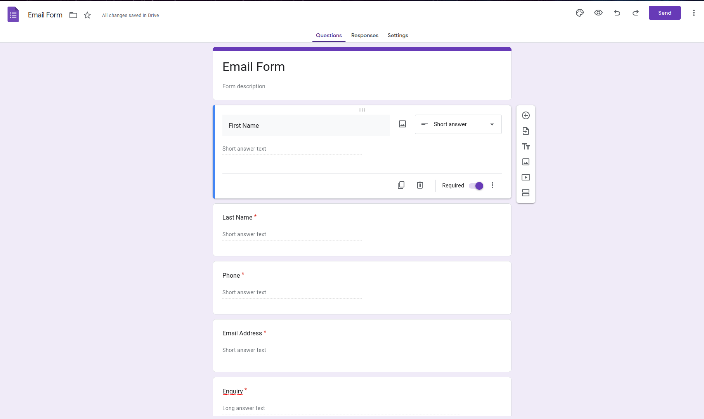
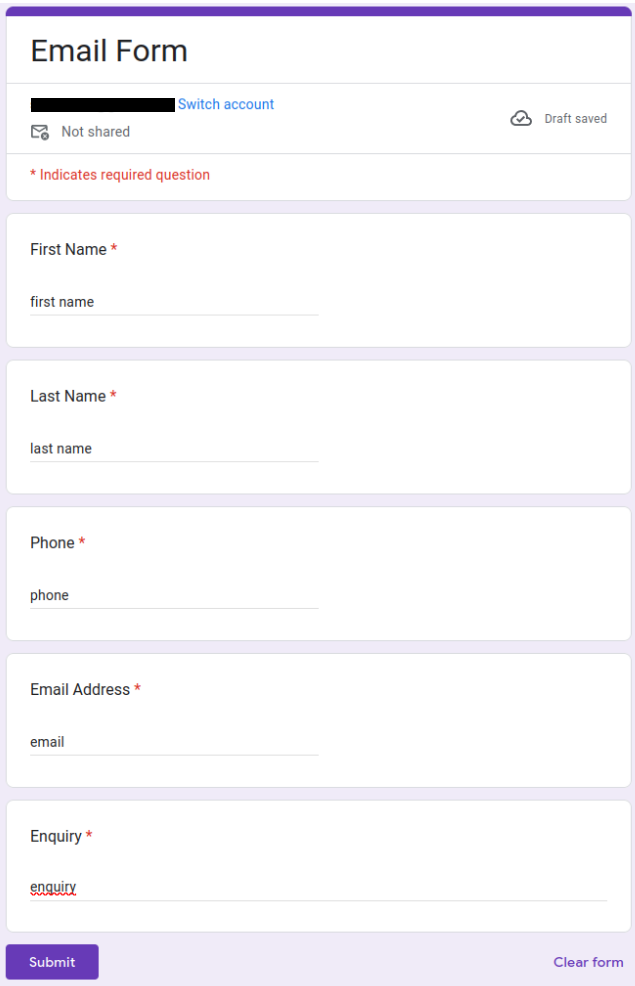
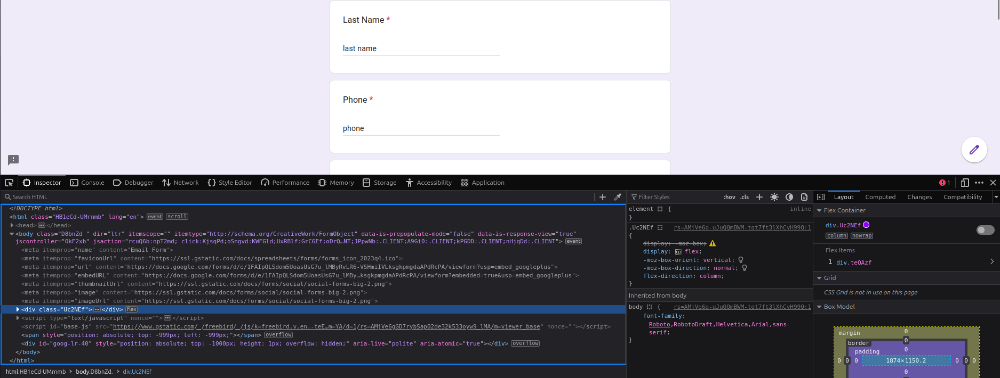
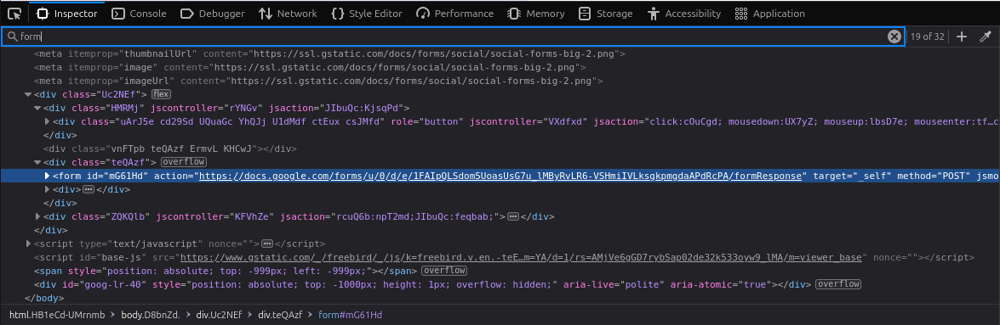
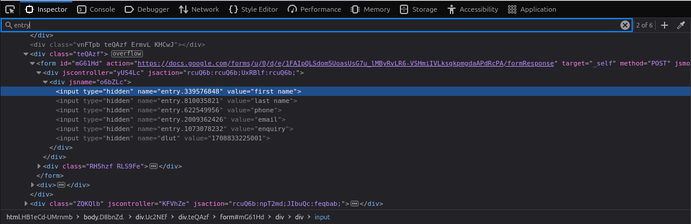

# Email Form Environment Variables

This documentation goes through the process on how to find the values required for the environment variables related to the email form on the 'Contact Us' Page.

## 1. Create a Google form

Create a google form with the following questions:
- First Name
- Last Name
- Phone
- Email
- Enquiry

All the questions should be short answer format except for 'Enquiry' which should be long answer. 

## 2. Prieview the form and fill out sample answers

Preview the form by clicking on the eye icon in the top right. This will open the form in a new tab.
Fill out the form so that the answers to each question is the same as the questions itself. For example, answer "first name" in the First Name field. 

Do not submit the form.

## 3. Find the value for `NEXT_PUBLIC_FORM_RESPONSE_URL`

With the answers filled out, right click on the page and click "inspect".
This will bring up the browser's inspector.

In the search bar above the code. search for 'form'. Continue to press enter until it finds a line that begins with `<form`. This tag should contain a url that ends with `/formResponse`

This url, without the quotation marks, will be the value of the `NEXT_PUBLIC_FORM_RESPONSE_URL` environment variable.

## 4. Find the values for the other environment variables

Next, search for 'entry'. Press enter until it finds a line beginning with `<input type="hidden"`. There should be six of them together. 

The first five input tags will contain a `name` and a `value`. The value for each tag contains the answer of each question that was entered earlier. This is so we can identify which tag belongs to each question.

The name attribute in each tag will be the values for the remaining variables.

For example:
- The name in the first tag with `value="first name"` is `entry.339576848`. `entry.339576848` will be the value for the `NEXT_PUBLIC_FIRSTNAME_FIELD_NAME` environment variable.

