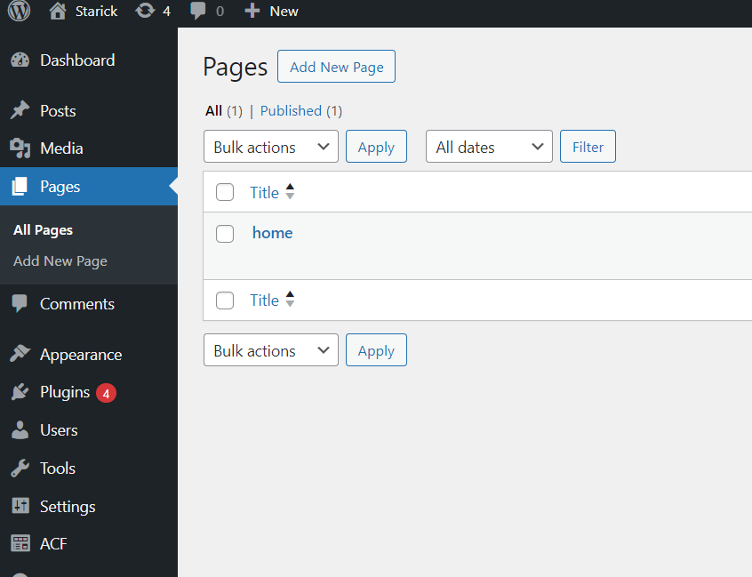
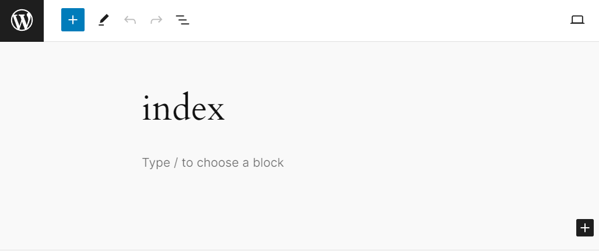
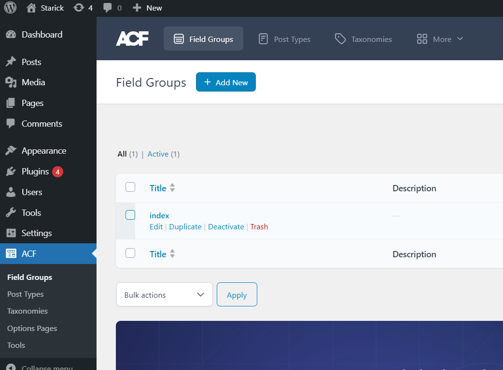
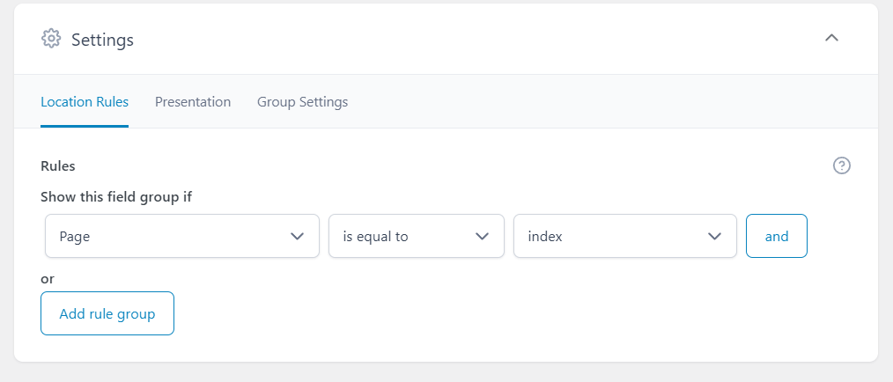
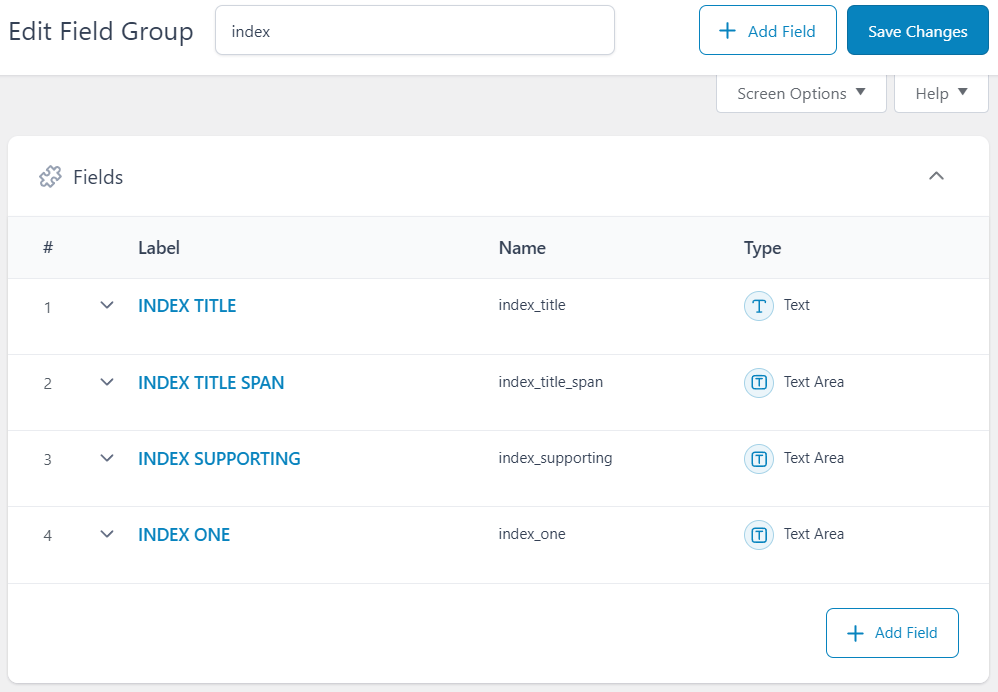
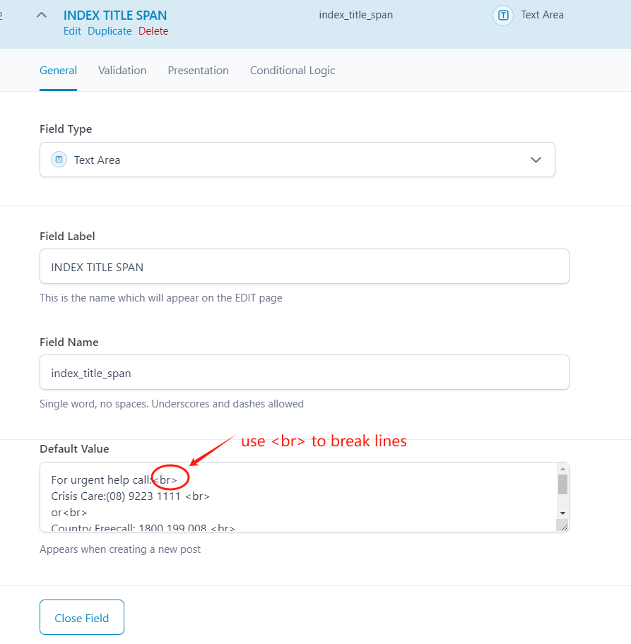

# Examples on using ACF plugin to define and retrieve custom fields from Wordpress

## Create an Empty Page

the page title should be the same as the corresponding page url in the frontend

## Create a Field Group

## Define Custom Fields inside the Field Group

## Retrieve Fields

Check code in src/pages/index.tsx